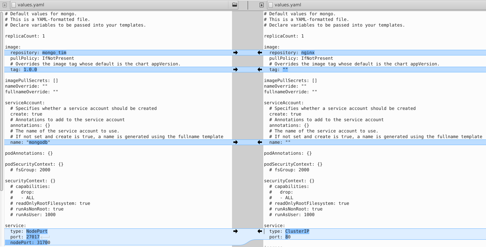
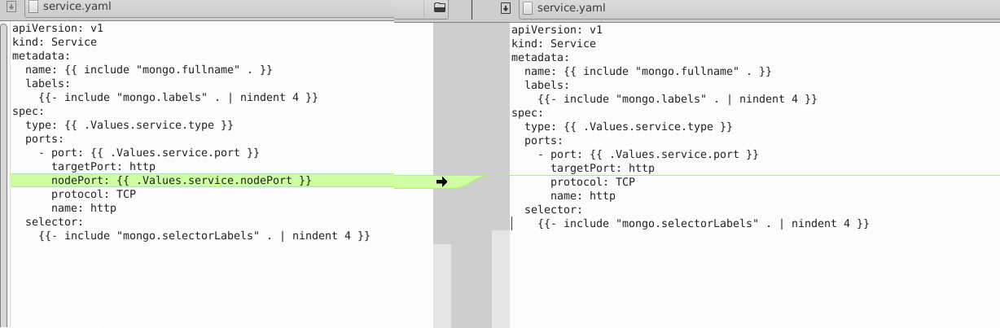

# helm

helm is used to simplify the deployment of a pod in a kubernates infrastructure. The following command can be used:

*  to **create**a new helm chart:


    helm create <helm-chart name>


This command create a directory containing the following files:

```plaintext
<helm-chart name>--+
                   + Chart/
                   + template/--+
                                + NOTES.txt  
                                + _helpers.tpl  
                                + deployment.yaml
                                + hpa.yaml  
                                + ingress.yaml  
                                + service.yaml  
                                + serviceaccount.yaml
                   + Charts.yaml                    
                   + value.yaml
```


**value. yaml** contains the  main configuration of the container, could be modified in order to insert the name of the docker image an the exposure of the port 

Comparing modified value.yaml (on the right) vs original value.yaml (on the left) we can see below the difference



In the value.yaml is changed: **image** information containing the repository and the tag and the **service** where is selected the port to expose with a **NodePort **service instead of ClusterIP. It is created also a serviceAccont "mongodb" probabily not used

it is added a parameter nodePort to fix the exposed port to a specific value. In order to add a parameter on **service **field you need to modify the service.yaml file adding the **nodePort **name in the following way:




* to **install** the pod use the following command:

    helm install <pod name> ./<helm chart> -n <namespace>


* to **remove** the pod for the K8s infrastructure the following command:

    helm uninstall <pod name> -n <namespace>


* ..
