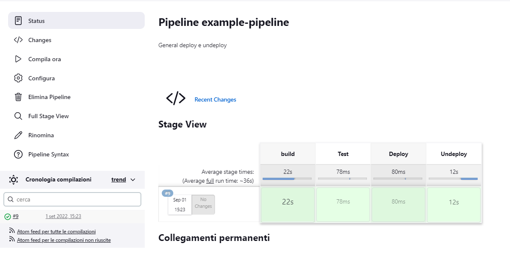

# Pipelines
Jenkins Pipeline (or simply "Pipeline" with a capital "P") is a suite of plugins which supports implementing and integrating //continuous delivery pipelines// into Jenkins.

A **continuous delivery (CD) pipeline** is an automated expression of your process for getting software from version control right through to your users and customers. Every change to your software (committed in source control) goes through a complex process on its way to being released. This process involves building the software in a reliable and repeatable manner, as well as progressing the built software (called a "build") through multiple stages of testing and deployment.

Ufficial Reference [jenkins.io](https://www.jenkins.io/doc/book/pipeline/)

Pipeline can be defined by script using Jenkinsfile, below i will collect interesting example of scritps that can be used for defining a Pipeline.

**Script to clone a GIT**

    pipeline {
        agent any
    
        stages {
            stage('build') {
                steps {
                    echo 'Building..'
                    git branch: 'jenkins_test', credentialsId: 'user', url: 'https://repo.githu.it/.gi'
                    sh 'bash command.sh'
                }
            }
            stage('Test') {
                steps {
                    echo 'Testing..'
                }
            }
            stage('Deploy') {
                steps {
                    echo 'Deploying....'
                }
            }
            stage('Un-Deploy'){
                steps {
                    sh 'docker-compose down -v'
                }
            }
        }
    }

The script above select one of the agent available, you can  select a specific agent removing the line"agent any"  and use:

    agent { node { label 'labelName' } }

The script above defines 4 stages ('Build', 'Test', 'Deploy', 'Undeploy'), each stage is composed by several steps, each line is a different step.

sh ' ...' allow to execute a command on the shell

In order to clone a GIT the line used is the following:

    git branch: 'jenkins_test', credentialsId: 'user', url: 'https://repo.githu.it/.gi'

* **branch**: identify the branch
* **credentialsId**: identify the ID of user that will connect to the GIT
* **url**: provide the link to the git

Saving the script and compiling the output will be shown below:

