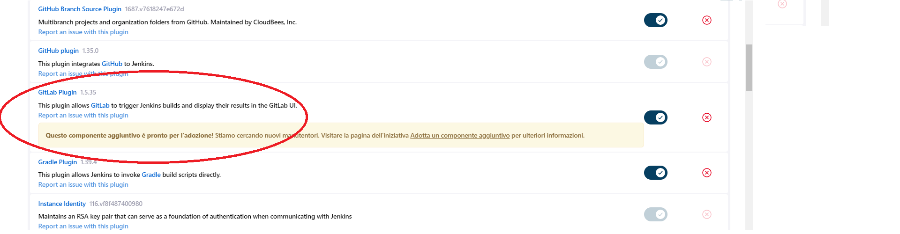
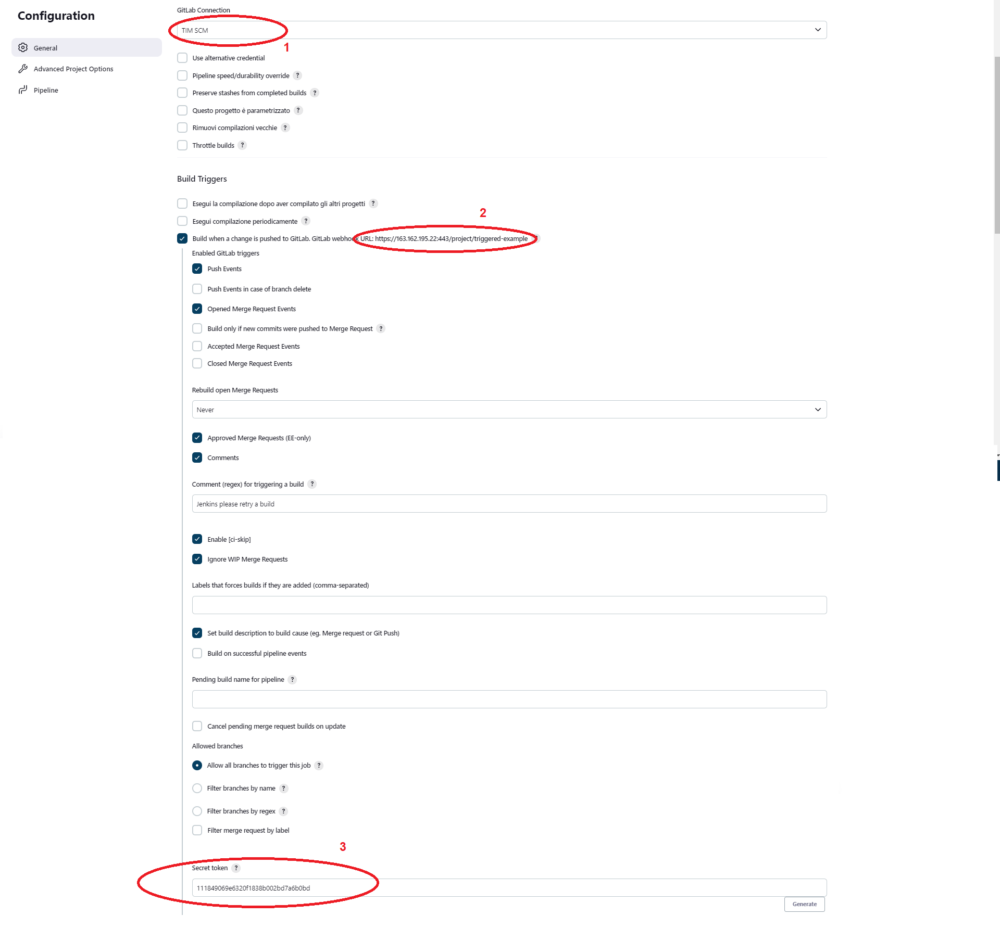
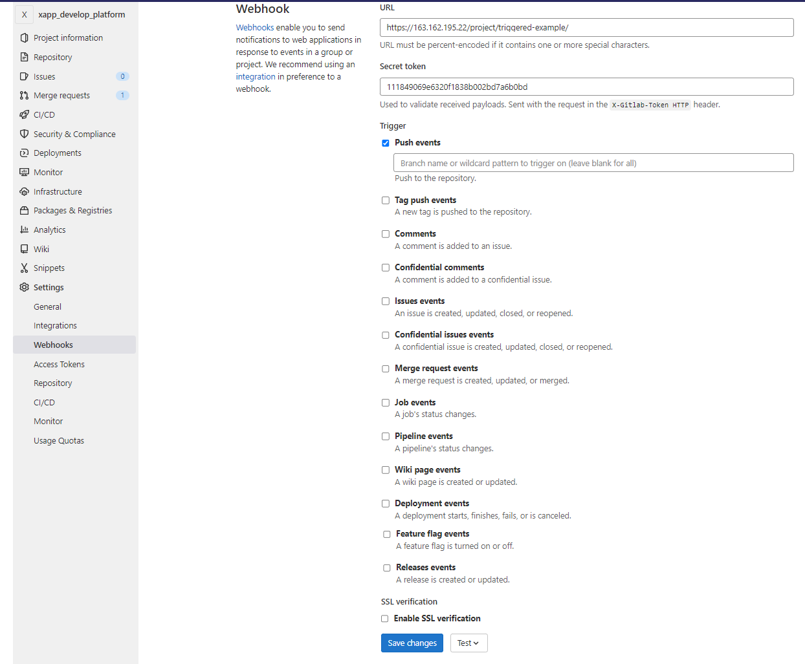

# Integration with GITLAB

This page is created starting from the information collected by this 2 link:

* [run jenkins on https](https://www.virtualizationhowto.com/2021/09/install-jenkins-on-ubuntu-21-04-with-self-signed-ssl-certificate/]) 
* [jenkins integration with GitLab](https://medium.com/@xthewiz/notify-jenkins-for-push-event-on-gitlab-18e2e4104827)

The firs step is generate a self-signed certificate to use for https.

### ssl key generation for https 

You can create a **keystore** directory where generete the cert and key files. This is the directory that I worked from in creating the necessary files. 

Run the openssl command to generate a .pem and a .key

    sudo openssl req -x509 -newkey rsa:4096 -keyout jenkins.key -out jenkins.pem -days 3650

the command will require to insert a password to be remember (es: password1 )

Next, we need to convert the SSL keys to a .p12 format. To do that, use the command:

    sudo openssl pkcs12 -export -keypbe PBE-SHA1-3DES -certpbe PBE-SHA1-3DES -export -in jenkins.pem -inkey jenkins.key -name jenkins -out jkeystore.p12

the command will require first  the password used in the first step (es: password1) and then new password (es: password2) then

Next step is to convert the .p12 format to JKS. To do that:

    sudo keytool -importkeystore -destkeystore jkeystore.jks -deststoretype PKCS12 -srcstoretype PKCS12 -srckeystore jkeystore.p12

In this step will be required the password used in the second step,

** At this point the .jks file is the one needed to be inserted in the configuration file**

You can create your certificate .crt file:

    sudo keytool -export -keystore jkeystore.jks -alias jenkins -file jenkins.cloud.local.crt

Finally, import this into your cacerts store:

    sudo keytool -importcert -file jenkins.cloud.local.crt -alias jenkins -keystore -cacerts

verify that all the file in the folder .keystore are onwned by jenkins:jenkins otherwise use command chown to change the ownership

    sudo chown jenkins:jenkins *

Now you need to modify the configuration file using in **/lib/systemd/system/jenkins.service** as sudo  in the following way:

--------------------------------------
*Environment="JENKINS_PORT="-1"*
*Environment="JENKINS_HTTPS_LISTEN_ADDRESS=0.0.0.0"*
*Environment="JENKINS_HTTPS_PORT=443"*

*Environment="JENKINS_HTTPS_KEYSTORE=jkeystore.jks"*
*Environment="JENKINS_HTTPS_KEYSTORE_PASSWORD=password used in the keytool comand step"*

*AmbientCapabilities=CAP_NET_BIND_SERVICE*

-----------------------------------------

Now using commands below jenkins will start on **https://<IP>**

    sudo systemctl daemon-reload
    sudo systemctl restart jenkins

At the first entering in Jenkins go on "Gestisci Jenkins" -> "Cofigura Sistema" -> "Percorso Jenkins" in order to modify the url with new one  **https://<IP>**

### Integration with GitLab 

1) The firs step is install the **GitLab **plugin in "Gestisci Jenkins" -> "Installa Componenti Aggiuntive", the plugin is the one shown in image below

2) The second step is the generation of a token in Gitlab

1. Go to **your profile picture**, click it and then **Settings -> Access Token**
1. Just enter your token name and its expire date, also check **api**, then click **Create personal access token**.
1. Save the generated token somewhere 

the generate token will be show in the up part of the page as shown in the image below:

3) Now the token has to be used in Jenkins to connect to the GiltLab server, 

1. from "Gestisci Jenkins" -> Configura Sistema -> gitLab Credential
1. Insert a Name to identify the GitLab Repository
1. Insert the url of the repository
1. Select as Kind of authentication "GitLab API Token" and add the token string saved in the step 2) 
1. You can use the botton "Test"

An example of how the actual connection to a gitlab repository is configured is shown in image below:

4) Now when you create a new Pipeline for test you need to select the Trigger "build when a push is trigger by GitLab"

1. You have to select the GitLab Repository name saved in step 3 (see 1 in image below)
1. Copy the url shown in the trigger (see 2 in the image below)
1. Generate a token to copy and use in the Webhook configuration in GitLab

The image below shown the configuration of a Pipeline Triggered by Giltab Push

5) In this last step it is needed configure the GitLab Webhook using the url and the token information obtained in step 4. It is important NOT check the ssl verification

An example of configuration of Webhook is shown in the image below:

the next session is on the [update of jenkins](jenkins_update.md)