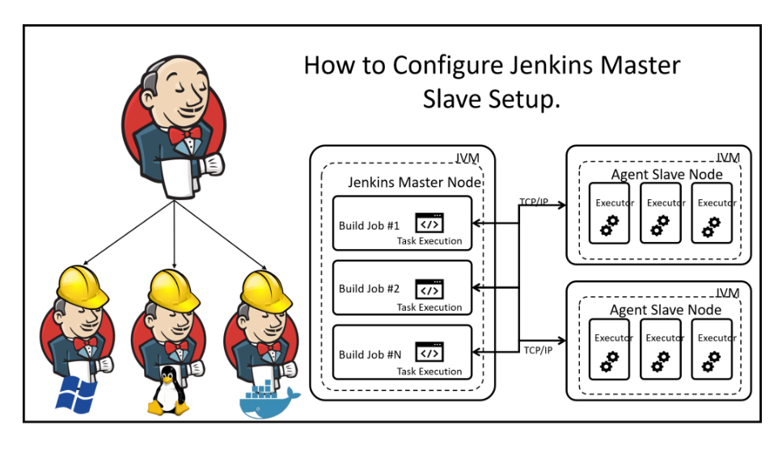

# Starting with Jenkins
Jenkins is a framework for CI/CD where is possible define pipelines for test build/deploy/run of a software

The Jenkins Architecture is Master-Slave, the master is a controller node that can lounch workload on a slave node using as agent to run command in the slave nodes. Typically Slave node could support different configuration to test the software with differnt O.S. or different CPUs atc ..

A Jenkins instance is running on host VM or Container configured as controller node, additionals nodes  can be added as agent node.
The best way to work is to run test on the Agent Node while the controll node is used to overview the system

continue on [How add a Node](Add_a_Node.md)